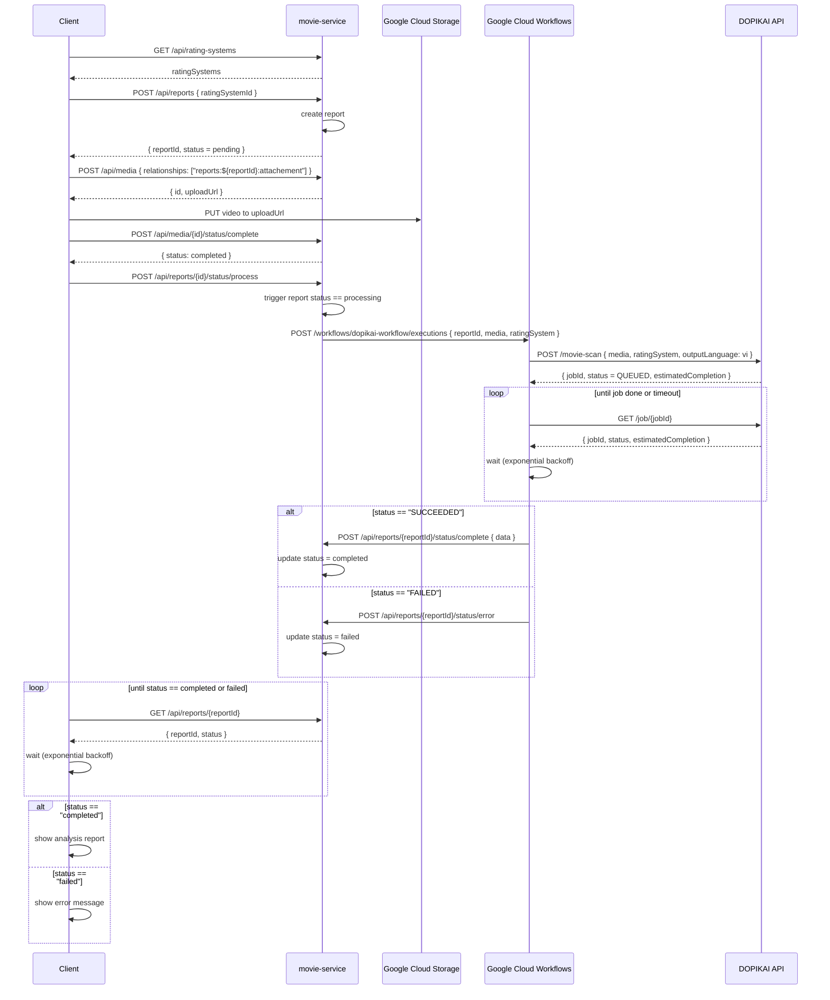

# 🎬 DOPIKAI Workflow - AI Video Scanning Pipeline

## 📋 Overview

The DOPIKAI Workflow is a Google Cloud Workflows orchestration system designed to process video content through AI-powered scanning and analysis. It integrates with external DOPIKAI API services to perform intelligent video analysis and stores results in dedicated Report entities.

## 🏗️ Architecture

### **Report Entity Design**

The DOPIKAI workflow uses a dedicated `Report` entity to track AI analysis jobs. This new entity will be added to the existing movie-service and will have a relationship with the existing Media entity:

```typescript
export interface RatingSystem {
  id: string
  name: string
  references: Array<{
    title: string
    url?: string
  }>
  levels: Array<{
    key: string
    title: string
    description: string
    guide: string // prompt
  }>
  guidelines: Array<{
    group: string
    name: string
    description: string
    keywords: Array<{
      key: string
      label: string
    }>
  }>
  createdAt: string
  updatedAt: string
}

export interface Report {
  id: string
  mediaId: string
  ratingSystemId: string
  status: 'pending' | 'processing' | 'completed' | 'failed'
  rating: {
    suggested: string
    analysis: string
  }
  scenes: Array<{
    confidence: number // 0-1 range
    startTime: string // ISO 8601 format
    endTime: string // ISO 8601 format
    guideline: string
    severity: 'critical' | 'high' | 'medium' | 'low'
    screenshots: Array<string> // ISO 8601 format
    analysis: {
      video: {
        violence?: number
        nudity?: number
        language?: number
        drugUse?: number
        [key: string]: number | undefined
      }
      audio: {
        profanity?: number
        violence?: number
        [key: string]: number | undefined
      }
    }
  }>
  createdAt: string // ISO 8601 format
  updatedAt: string // ISO 8601 format
}
```

### **Upload Flow with Signed URLs**

The workflow uses a **signed URL upload pattern** for optimal performance and security:

1. **Client requests upload**: Sends media data to movie-service
2. **Service generates signed URL**: Creates secure, time-limited upload URL
3. **Direct upload to GCS**: Client uploads video directly to Google Cloud Storage
4. **Upload confirmation**: Client confirms successful upload
5. **Workflow trigger**: DOPIKAI workflow is initiated with video URL

**Benefits:**

- **Performance**: Direct upload to GCS, no proxy through movie-service
- **Security**: Signed URLs with expiration and limited permissions
- **Scalability**: Reduces load on movie-service
- **Reliability**: Direct cloud storage upload with retry capabilities



## 🔌 API Endpoints

### **Complete Workflow Flow**

#### **1. Request Upload URL**

```http
POST /api/media
Content-Type: application/json

{
  "contentType": "video/mp4",
  "fileName": "video.mp4",
  "type": "original",
  "format": "mp4",
  "fileSize": 104857600,
  "duration": 120,
  "language": "en",
  "description": "Video for DOPIKAI scanning",
  "tags": ["test"],
  "resolution": "1920x1080",
  "bitrate": 4000,
  "frameRate": 30,
  "status": "pending",
  "relationships": ["title:title_123:trailer"]
}
```

**Response:**

```json
{
  "id": "media_123456",
  "uploadUrl": "https://storage.googleapis.com/bucket/media_123456/video.mp4?X-Goog-Algorithm=...",
  "status": "pending"
}
```

#### **2. Upload Video to Signed URL**

```http
PUT {upload_url}
Content-Type: video/mp4

[video binary data]
```

#### **3. Confirm Upload**

```http
POST /api/media/{media_id}/status/complete
Content-Type: application/json

{
  "finalSize": 104857600,
  "etag": "completed"
}
```

**Response:**

```json
{
  "media_id": "media_123456",
  "status": "completed",
  "video_url": "https://storage.googleapis.com/bucket/media_123456/video.mp4",
  "dopikai_workflow_triggered": true
}
```

#### **4. Get Available Rating Systems**

```http
GET /api/rating-systems
```

**Response:**

```json
[
  {
    "id": "mpaa_rating_system_001",
    "name": "MPAA",
    "references": [
      {
        "title": "MPAA Film Rating System",
        "url": "https://www.mpaa.org/film-ratings/"
      }
    ],
    "levels": [
      {
        "key": "R",
        "title": "Restricted",
        "description": "Under 17 requires accompanying parent or adult guardian",
        "guide": "Contains some adult material"
      }
    ],
    "guidelines": [
      {
        "group": "violence",
        "name": "Violence Detection",
        "description": "Detect violent content and scenes",
        "keywords": [
          {
            "key": "violence",
            "label": "Violence"
          },
          {
            "key": "blood",
            "label": "Blood"
          },
          {
            "key": "weapons",
            "label": "Weapons"
          }
        ]
      },
      {
        "group": "nudity",
        "name": "Nudity Detection",
        "description": "Detect nudity and sexual content",
        "keywords": [
          {
            "key": "nudity",
            "label": "Nudity"
          },
          {
            "key": "sexual_content",
            "label": "Sexual Content"
          }
        ]
      }
    ],
    "createdAt": "2024-01-01T00:00:00Z",
    "updatedAt": "2024-01-01T00:00:00Z"
  }
]
```

#### **5. Create DOPIKAI Report**

```http
POST /api/reports
Content-Type: application/json

{
  "media": {
    "id": "media_123456",
    "fileUrl": "https://storage.googleapis.com/bucket/media_123456/video.mp4"
  },
  "ratingSystem": {
    "id": "mpaa_rating_system_001",
    "name": "MPAA",
    "references": [
      {
        "title": "MPAA Film Rating System",
        "url": "https://www.mpaa.org/film-ratings/"
      }
    ],
    "levels": [
      {
        "key": "R",
        "title": "Restricted",
        "description": "Under 17 requires accompanying parent or adult guardian",
        "guide": "Contains some adult material"
      }
    ],
    "guidelines": [
      {
        "group": "violence",
        "name": "Violence Detection",
        "description": "Detect violent content and scenes",
        "keywords": [
          {
            "key": "violence",
            "label": "Violence"
          },
          {
            "key": "blood",
            "label": "Blood"
          },
          {
            "key": "weapons",
            "label": "Weapons"
          }
        ]
      }
    ],
    "createdAt": "2024-01-01T00:00:00Z",
    "updatedAt": "2024-01-01T00:00:00Z"
  }
}
```

**Response:**

```json
{
  "id": "report_789",
  "mediaId": "media_123456",
  "ratingSystemId": "mpaa_rating_system_001",
  "status": "processing",
  "rating": {
    "suggested": "",
    "analysis": ""
  },
  "scenes": [],
  "createdAt": "2024-01-15T10:00:00Z",
  "updatedAt": "2024-01-15T10:00:00Z"
}
```

#### **6. Trigger DOPIKAI Workflow**

```http
POST /workflows/dopikai-workflow/executions
Content-Type: application/json
Authorization: Bearer {access_token}

{
  "reportId": "report_789",
  "media": {
    "fileUrl": "https://storage.googleapis.com/bucket/media_123456/video.mp4"
  },
  "ratingSystem": {
    "id": "mpaa_rating_system_001",
    "name": "MPAA",
    "references": [
      {
        "title": "MPAA Film Rating System",
        "url": "https://www.mpaa.org/film-ratings/"
      }
    ],
    "levels": [
      {
        "key": "R",
        "title": "Restricted",
        "description": "Under 17 requires accompanying parent or adult guardian",
        "guide": "Contains some adult material"
      }
    ],
    "guidelines": [
      {
        "group": "violence",
        "name": "Violence Detection",
        "description": "Detect violent content and scenes",
        "keywords": [
          {
            "key": "violence",
            "label": "Violence"
          },
          {
            "key": "blood",
            "label": "Blood"
          },
          {
            "key": "weapons",
            "label": "Weapons"
          }
        ]
      }
    ],
    "createdAt": "2024-01-01T00:00:00Z",
    "updatedAt": "2024-01-01T00:00:00Z"
  }
}
```

**Response:**

```json
{
  "name": "projects/movie-dubie/locations/us-central1/workflows/dopikai-workflow/executions/execution_123",
  "state": "ACTIVE",
  "startTime": "2024-01-15T10:00:00Z"
}
```

**Note:** Movie-service should use the Google Cloud Workflows REST API to trigger workflows programmatically, not the gcloud CLI. The gcloud CLI is for manual testing and deployment only.

#### **7. DOPIKAI API - Start Movie Scan**

```http
POST /movie-scan
Content-Type: application/json
Authorization: Bearer {dopikai_api_key}

{
  "media": {
    "fileUrl": "https://storage.googleapis.com/bucket/media_123456/video.mp4"
  },
  "ratingSystem": {
    "id": "mpaa_rating_system_001",
    "name": "MPAA",
    "references": [
      {
        "title": "MPAA Film Rating System",
        "url": "https://www.mpaa.org/film-ratings/"
      }
    ],
    "levels": [
      {
        "key": "R",
        "title": "Restricted",
        "description": "Under 17 requires accompanying parent or adult guardian",
        "guide": "Contains some adult material"
      }
    ],
    "guidelines": [
      {
        "group": "violence",
        "name": "Violence Detection",
        "description": "Detect violent content and scenes",
        "keywords": [
          {
            "key": "violence",
            "label": "Violence"
          },
          {
            "key": "blood",
            "label": "Blood"
          },
          {
            "key": "weapons",
            "label": "Weapons"
          }
        ]
      }
    ],
    "createdAt": "2024-01-01T00:00:00Z",
    "updatedAt": "2024-01-01T00:00:00Z"
  },
  "outputLanguage": "vi"
}
```

**Response:**

```json
{
  "jobId": "dopikai_job_789",
  "status": "QUEUED",
  "estimatedCompletion": "2024-01-15T10:15:00Z"
}
```

#### **8. DOPIKAI API - Check Job Status**

```http
GET /job/{jobId}
Authorization: Bearer {dopikai_api_key}
```

**Response (Processing):**

```json
{
  "jobId": "dopikai_job_789",
  "status": "PROCESSING",
  "estimatedCompletion": "2024-01-15T10:15:00Z"
}
```

**Response (Completed):**

```json
{
  "jobId": "dopikai_job_789",
  "status": "SUCCEEDED",
  "data": {
    "rating": {
      "suggested": "R",
      "analysis": "The ML model detected adult content with 87% confidence. The LLM analysis identified sexual content that may require age restrictions..."
    },
    "scenes": [
      {
        "confidence": 0.91,
        "startTime": "2024-01-15T10:05:30Z",
        "endTime": "2024-01-15T10:06:15Z",
        "guideline": "violence_001",
        "severity": "high",
        "screenshots": ["2024-01-15T10:05:45Z"],
        "analysis": {
          "video": {
            "violence": 0.88,
            "nudity": 0.85
          },
          "audio": {
            "profanity": 0.75
          }
        }
      }
    ]
  }
}
```

**Response (Failed):**

```json
{
  "jobId": "dopikai_job_789",
  "status": "FAILED",
  "errorInfo": {
    "code": "INVALID_VIDEO_FORMAT",
    "message": "Invalid video format or corrupted file",
    "details": "The provided video file is not in a supported format or appears to be corrupted."
  }
}
```

#### **9. Update Report Status (Workflow Callback)**

```http
POST /api/reports/{reportId}/status/complete
Content-Type: application/json

{
  "data": {
    "rating": {
      "suggested": "R",
      "analysis": "The ML model detected adult content with 87% confidence. The LLM analysis identified sexual content that may require age restrictions..."
    },
    "scenes": [
      {
        "confidence": 0.91,
        "startTime": "2024-01-15T10:05:30Z",
        "endTime": "2024-01-15T10:06:15Z",
        "guideline": "violence_001",
        "severity": "high",
        "screenshots": ["2024-01-15T10:05:45Z"],
        "analysis": {
          "video": {
            "violence": 0.88,
            "nudity": 0.85
          },
          "audio": {
            "profanity": 0.75
          }
        }
      }
    ]
  }
}
```

**Response:**

```json
{
  "id": "report_789",
  "mediaId": "media_123456",
  "ratingSystemId": "mpaa_rating_system_001",
  "status": "completed",
  "rating": {
    "suggested": "R",
    "analysis": "The ML model detected adult content with 87% confidence. The LLM analysis identified sexual content that may require age restrictions..."
  },
  "scenes": [
    {
      "confidence": 0.91,
      "startTime": "2024-01-15T10:05:30Z",
      "endTime": "2024-01-15T10:06:15Z",
      "guideline": "violence_001",
      "severity": "high",
      "screenshots": ["2024-01-15T10:05:45Z"],
      "analysis": {
        "video": {
          "violence": 0.88,
          "nudity": 0.85
        },
        "audio": {
          "profanity": 0.75
        }
      }
    }
  ],
  "createdAt": "2024-01-15T10:00:00Z",
  "updatedAt": "2024-01-15T10:15:00Z"
}
```

**Alternative: Failed Status Update**

```http
POST /api/reports/{reportId}/status/error
Content-Type: application/json

{}
```

**Response:**

```json
{
  "id": "report_789",
  "mediaId": "media_123456",
  "ratingSystemId": "mpaa_rating_system_001",
  "status": "failed",
  "rating": {
    "suggested": "",
    "analysis": "Processing failed"
  },
  "scenes": [],
  "createdAt": "2024-01-15T10:00:00Z",
  "updatedAt": "2024-01-15T10:15:00Z"
}
```

#### **10. Check Report Status (Client Polling)**

```http
GET /api/reports/{report_id}
```

**Response:**

```json
{
  "id": "report_789",
  "mediaId": "media_123456",
  "ratingSystemId": "mpaa_rating_system_001",
  "status": "processing",
  "rating": {
    "suggested": "",
    "analysis": ""
  },
  "scenes": [],
  "createdAt": "2024-01-15T10:00:00Z",
  "updatedAt": "2024-01-15T10:00:00Z"
}
```
